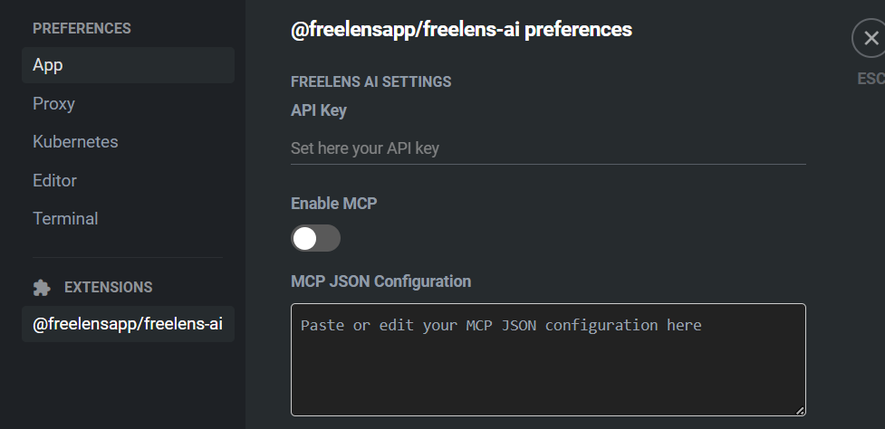
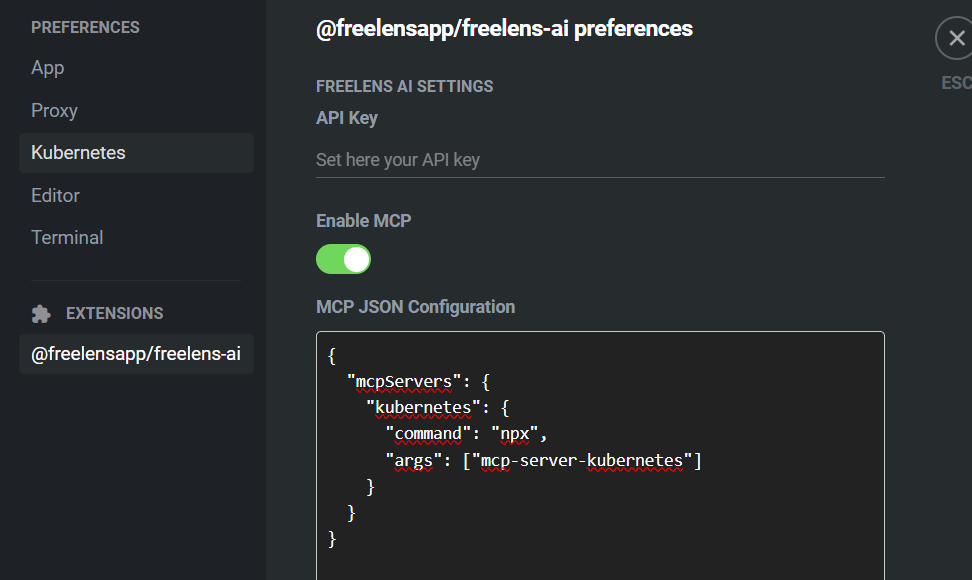

# Setting Up an MCP Agent for Freelens-AI 📡 

This guide will walk you through setting up an MCP (Model Control Protocol) agent to work with Freelens-AI, enabling you to control and interact with AI agents running on your infrastructure.

## Prerequisites

- You have Freelens-AI installed.
- You have Node.js and npx available in your system.
- You have an OpenAI API Key, at the moment it only works with its models

## Configuration

Freelens-AI allows you to configure MCP agents directly from its Preferences page.

1. Open Freelens-AI Preferences<br/>
Launch Freelens-AI and go to the Preferences page then locate the MCP Configuration
section.

2. Enable MCP Support<br/>
Toggle the Enable MCP Agent option.<br />
This enables Freelens-AI to communicate with MCP agents running on your machine or cluster.

3. Add an MCP Server Configuration<br/>
Inside the dedicated JSON textarea, add your MCP server configuration.<br />
Below is the pre-built configuration for the MCP server for Kubernetes, included in Freelens-AI.

```json
{ 
    "mcpServers": { 
        "kubernetes": { 
            "command": "npx", 
            "args": ["mcp-server-kubernetes"] 
        } 
    } 
} 
```

✅ This uses npx to launch the mcp-server-kubernetes module. You can replace
this with your own agent command.

🚀 Recommended MCP Agent

For a robust setup, especially in Kubernetes environments, we recommend:
<https://github.com/Flux159/mcp-server-kubernetes>

🖼️ Screenshots




## Troubleshooting

### Slow first message

- When you set up MCP Agent, the first message in chat it handles can be slow
  because it need to be initialized (our client should connect to the MCP
  Server you specified), so just wait for it to be fully initialized

### How the default configuration works

The pre-built configuration spawns `npx mcp-server-kubernetes`, so the very
first launch downloads the package from the npm registry, while later launches
reuse the npx cache. You never have to start the MCP server yourself: the
extension always spawns its own instance of the command you configured.

### Connection closed right after startup

The developer console shows an error like:

```text
MCPClientError: Failed to connect to stdio server ... MCP error -32000: Connection closed
```

This means the spawned server process exited immediately. The first diagnostic
step is to run the configured command manually in a terminal:

```bash
npx mcp-server-kubernetes
```

The real error becomes visible there. A healthy stdio server prints little or
nothing and keeps waiting for input, so exit it with Ctrl+C.

### Corrupted npx cache

If the first download was interrupted, the cache entry stays broken forever and
every run fails at import time with `ERR_MODULE_NOT_FOUND` pointing inside
`npm-cache/_npx/<hash>`. Delete that cache directory, then run the command
again to download the package from scratch. The hash is the one shown in the
error path.

On Windows (PowerShell):

```powershell
Remove-Item -Recurse -Force "$env:LOCALAPPDATA\npm-cache\_npx\<hash>"
```

On macOS and Linux:

```bash
rm -rf ~/.npm/_npx/<hash>
```

### Corporate networks with TLS inspection

Where TLS traffic is inspected, the first npx download can fail with
certificate errors. Point both npm and Node.js at the corporate root
certificate:

```bash
npm config set cafile <corporate-root-ca.pem>
```

and set the `NODE_EXTRA_CA_CERTS` environment variable to the same file.

### Recommended stable setup

To avoid any download when the extension starts, install the server once:

```bash
npm install -g mcp-server-kubernetes
```

and then reference the command directly in the MCP configuration:

```json
{
    "mcpServers": {
        "kubernetes": {
            "command": "mcp-server-kubernetes"
        }
    }
}
```

### Windows: wrapping the command

If spawning `npx` directly keeps failing while the manual run works, wrap the
command with the Windows command interpreter:

```json
{
    "mcpServers": {
        "kubernetes": {
            "command": "cmd",
            "args": ["/c", "npx", "mcp-server-kubernetes"]
        }
    }
}
```

Connection failures are currently only visible in the developer console;
user-facing error reporting is tracked in issue
[#274](https://github.com/freelensapp/freelens-ai-extension/issues/274).
